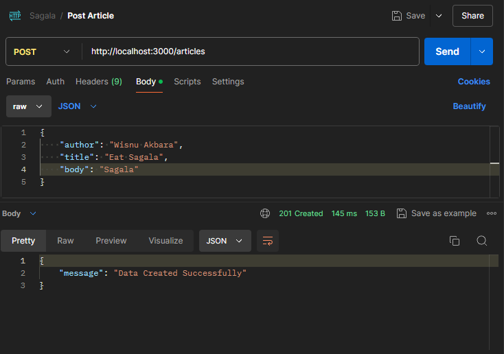
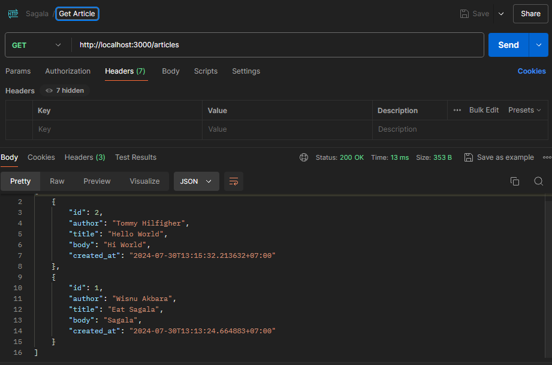
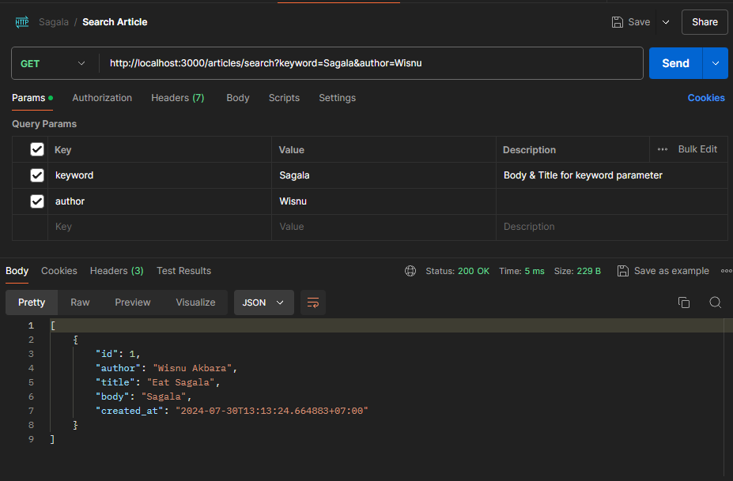

# Simple Web Service

A simple web service Sagala using :

<p align="center"><a href="https://go.dev" target="_blank"></a></p>

## Requirements

Sagala is currently extended with the following requirements.  
Instructions on how to use them in your own application are linked below.

| Requirement | Version |
| ----------- | ------- |
| Go          | 1.21.5  |
| Postgres    | 14.10.^ |
| Redis       | 8.11.5  |

## Installation

Make sure the requirements above already install on your system.  
Clone the project to your directory and install the dependencies.

```bash
$ git clone https://github.com/wisnuuakbr/sagala
```
```bash
$ cd sagala
```
```bash
$ go mod tidy
```

## Configuration

Copy the .env.example file and rename it to .env
```bash
$ cp .env.example .env
```
Change the config for your local server

```bash
APP_NAME = "sagala"
APP_ENV = "development"
APP_PORT = 3000

POSTGRES_HOST_MASTER = "localhost"
POSTGRES_PORT_MASTER = 5432
POSTGRES_USER_MASTER = "postgres"
POSTGRES_PASSWORD_MASTER = "postgres"
POSTGRES_DB_MASTER = "sagala_v1_db"

REDIS_HOST = "localhost"
REDIS_PORT = 6379
REDIS_PASSWORD = ""
REDIS_DB = 0

```

## Run Application
```bash
$ go run .\cmd\main.go
```

## Output
### POST article:



### GET All Article:



### GET Article with filter

